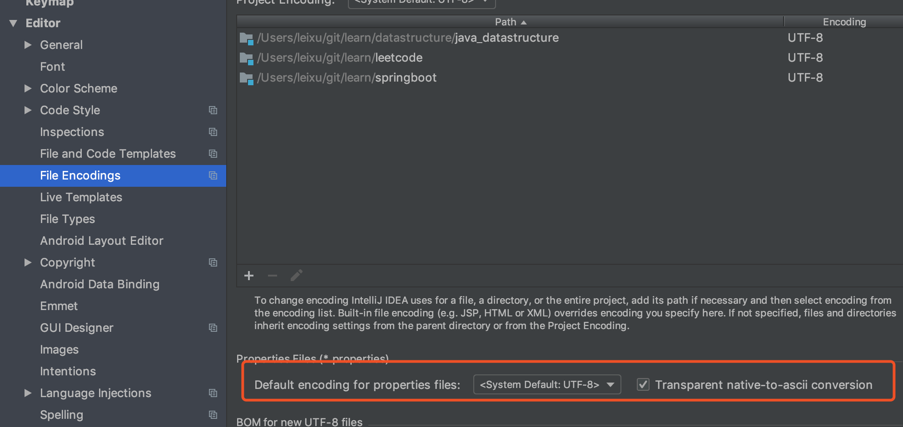

# 一，Spring boot 

## 1，HelloWorld 项目探究

[官方文档](https://docs.spring.io/spring-boot/docs/current/reference/html/index.html)

### 1， pom.xml

#### 1, 父项目

```xml
	<parent>
		<groupId>org.springframework.boot</groupId>
		<artifactId>spring-boot-starter-parent</artifactId>
		<version>2.1.4.RELEASE</version>
		<relativePath/> <!-- lookup parent from repository -->
	</parent>

他的父项目是

<parent>
<groupId>org.springframework.boot</groupId>
<artifactId>spring-boot-dependencies</artifactId>
<version>2.1.4.RELEASE</version>
<relativePath>../../spring-boot-dependencies</relativePath>
</parent>
他真正管理spring boot 应用里边的所有以来版本
```

spring boot的版本仲裁中心；

以后导入以来默认不需要写版本；若没有在dependencies中，则需要声明版本号。

#### 2，导入的依赖

```xml
		<dependency>
			<groupId>org.springframework.boot</groupId>
			<artifactId>spring-boot-starter-web</artifactId>
		</dependency>
```

Spring-boot-start-==web==
[starter](https://docs.spring.io/spring-boot/docs/current/reference/html/using-boot-build-systems.html#using-boot-starter)文档

spring-boot-starter：sping-boot场景启动器。帮我们导入了web模块正常运行所依赖的组件；

spring boot 将所有的功能场景都抽取出来，做成一个个的starters（启动器），只需要在项目中引入这些starter相关场景的所有以来都会导入进来，要用什么功能就导入什么场景的启动器。

### 2，主程序类，主入口类

```java
/*
 * SpringBootApplication用来标注一个主程序类，说明这是一个spring boot的应用
 */
@SpringBootApplication
public class SprintBootApplication {
    public static void main(String[] args) {
        SpringApplication.run(SprintBootApplication.class, args);
    }
}

```

**@SpringBootApplication**：spring boot应用标注在某个类上说明这个类为spring boot的主配置类， spring boot就应该运行这个类的main函数来启动spring boot应用。

```java
@Target({ElementType.TYPE})
@Retention(RetentionPolicy.RUNTIME)
@Documented
@Inherited
@SpringBootConfiguration
@EnableAutoConfiguration
@ComponentScan(
    excludeFilters = {@Filter(
    type = FilterType.CUSTOM,
    classes = {TypeExcludeFilter.class}
), @Filter(
    type = FilterType.CUSTOM,
    classes = {AutoConfigurationExcludeFilter.class}
)}
)
public @interface SpringBootApplication {}
```

@**SpringBootConfiguration**:  spring boot的配置类；

标注在某个类上，表示这是一个sping boot的配置类；

@Configuration：配置类上标注这个注解；

配置类——配置文件；配置类也是文件中的一个注解。

@**EnableAutoConfiguration**：开启自动配置功能

以前我们需要配置的东西，spring boot帮我们自动配置；@EnableAutoConfiguration告诉springboot开启自动配置功能；这样子自动配置才生效。

```java
@AutoConfigurationPackage
@Import({AutoConfigurationImportSelector.class})
public @interface EnableAutoConfiguration {
```

@**AutoConfigurationPackage**:自动配置包

@Import({Registrar.class})：spring的底层注解@Import，给容器中倒入一个组件；导入的组件由Registrar.class指定。

==将主配置类（@SpringBootApplication标注的类）的所在包以及下面所有子包留的所有组件扫描到Spring容器；==

@**Import**({AutoConfigurationImportSelector.class});

给容器导入组件？

 AutoConfigurationImportSelector导入组件选择器：导入哪些组件的选择器；

将所有需要导入的组件以全类名的方式返回，这些组件就会被添加到容器中，会给容器中倒入非常多的自动配置类（xxAutoConfiguration）：就是给容器中倒入这个场景需要的所有组件，并配置好这些组件。


有了自动配置类，免去了手动编写配置和注入功能组件等的工作。

```java
SpringFactoriesLoader.loadFactoryNames(EnableAutoConfiguration.class,classLoader)
```

==Springboot在启动的时候从类路径下的META-INF/spring.factories中获取EnableAutoConfiguration指定的值，将这些值座位自动配置类导入到容器中，自动配置类就生效了，帮我们进行自动配置工作；==以前我们需要自己配置的东西，自动配置类都帮我们做。

J2EE的整合整体解决方案和自动配置都在spring-boot-autoconfigure-2.14.RELEASE.jar;

### 3， 使用Spring Initializer 快速创建Spring Boot项目

IDE都支持使用Spring Initializer快速创建项目

- 主程序已经好了，只需要编写自己的逻辑
- resources文件夹中目录结构
  - static：保存所有的静态资源，js，css image
  - templates：保存所有的模板界面，
  - application.properties： springboot的配置文件，可以修改一些默认配置


## 二，配置文

### 1, 配置文件

Spring boot使用一个全局的配置文件，配置文件名是固定的：

application.properties

application.yml

yml, （yaml aint’t markup language）

YAML a markup language:是一种标记语言

YAML ：不是一种标记语言

标记语言：

yaml是以数据为中心，例如

```yaml
server:
    port:8082
```

### 2， YAML 语法

#### 1, 基本语法

1， k:(空格) v：表示一堆键值对，空格必须要有

2， 以**空格**的缩进来表示层级关系；只要左对齐的一列数据，都是同一个层级的，如下例：

```yaml
server:
  port: 8000
---
spring:
  profiles: default
  security:
    user:
      password: weak
```

3， 属性和值大小写敏感

#### 2，值的写法

##### 字面量：普通的值(数字，字符串，布尔)

k: v，字面直接来写

​	字符串默认不用加上单引号或者双引号

​	“”：双引号，不会转义字符串里的特殊字符，特殊字符会座位本身想表示的意思。

​			name: “zhangsan \n lisi” 

​			output: zhangsan 换行 lisi

​	‘’： 会转义特殊字符，特殊字符就会被转义为一个普通的字符串数据

​			name: ‘zhangsan \n lisi’

​			output: ‘zhangsan \n lisi’

##### 对象，Map（属性和值）（键值对）：

k: v：在下一行来写对象的属性和值的关系；注意缩进

​			对象还是k: v的表达方式

```yaml
server:
  port: 8000
---
spring:
  profiles: default
  security:
    user:
      password: weak
```

##### 数组（List, set）

用- 值表示数组的一个元素

```yaml
pets:
 - cat
 - dog
 - pig
```

行内写法

```
pet: [cat, dog, pig]
```

#### 3, 配置文件值注入

配置文件

```yaml
person:
  name: zhangsan
  age: 18
  birth: 2017/12/12
  maps: {k1: v1, k2: v2}
  lists:
    - lisi
    - wangwu
  dog:
    name: xiaoguo
    age: 1
```

javaBean

```java
/**
 * 将配置文件中的每一个属性值，映射到这个组件中
 *
 * @ConfigurationProperties,告诉spring boot将奔雷中的所有属性和配置文件中相关的配置进行绑定
 * prefix="person":配置文件中哪个下面的所有属性进行一一映射
 * <p>
 * 只有这个组件在容器中，才能使用容器中提供的@ConfigurationProperties功能
 */
@Component
@ConfigurationProperties(prefix = "person")
public class Person {
  private String Name;
  private Integer age;
  private Date birth;
  private Map<String, Object> maps;
  private List<Object> lists;
  private Dog dog;
```

我们可以导入配置文件处理器，以后编写文件就会有提示

```xml
        <dependency>
            <groupId>org.springframework.boot</groupId>
            <artifactId>spring-boot-configuration-processor</artifactId>
            <optional>true</optional>
        </dependency>
```


##### 1, properties 配置文件在idea中默认utf-8可能会乱码



##### 2， @Value获取值与@ConfigurationProperties获取值比较


|                | @Value       | @ConfigurationProperties |
| -------------- | ------------ | ------------------------ |
| 功能           | 一个一个指定 | 批量注入配置文件中的属性 |
| 松散绑定       | 不支持       | 支持                     |
| SpEL           | 支持         | 不支持                   |
| JSR303数据校验 | 不支持       | 支持（@Validated）       |

配置文件yml还是properties他们都能获取值

若只是在某个业务逻辑中需要获取一下配置文件中的某项值，那么我们就用@Value

 若专门编写了一个javaBean来和配置文件进行映射，直接使用@ConfigurationProperties

##### 3，配置文件注入值数据校验

```java
@Component
@ConfigurationProperties(prefix = "person")
@Validated
public class Person {

  @Email
  private String Name;
  private Integer age;
  private Date birth;
  private Map<String, Object> maps;
  private List<Object> lists;
  private Dog dog;
```

##### 4，@PropertySource & @ImportResource

**@ConfigurationProperties**某人从全局的配置文件中获取值

**@PropertySource**指定加载指定的文件

```java
@PropertySource(value = {"classpath:person.properties"})
@Component
@ConfigurationProperties(prefix = "person")
public class Person {

  private String Name;
  private Integer age;
  private Date birth;
  private Map<String, Object> maps;
  private List<Object> lists;
  private Dog dog;
```

**@ImportResource**：导入Spring的配置文件，让配置文件中的内容生效


